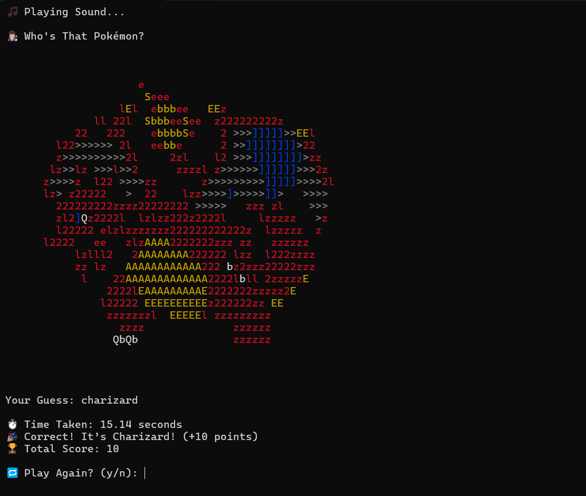
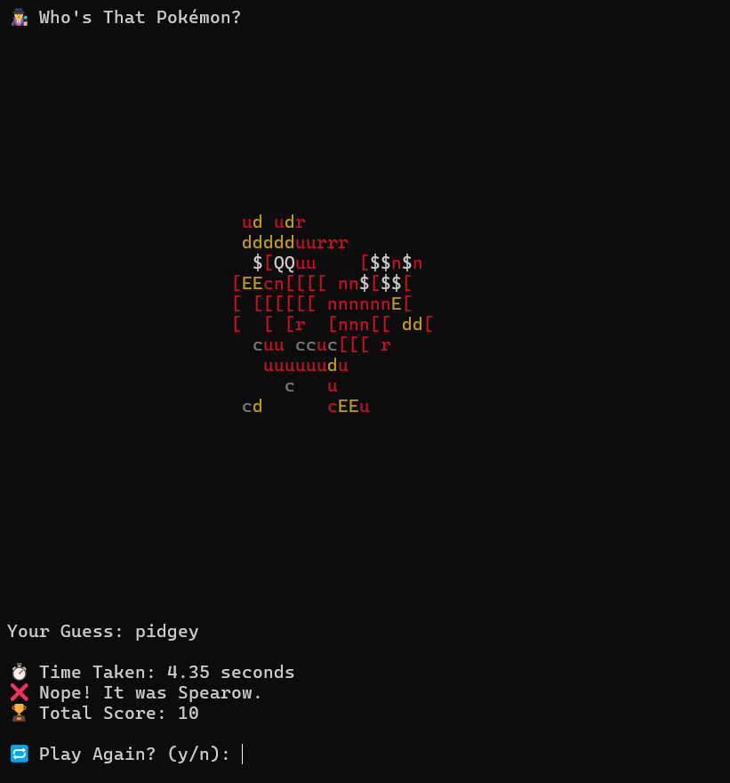

<p align="center">
  
</p>

<h1 align="center">Who's That Pokémon? 🔍 (CLI Edition)</h1>

<p align="center">
  A fun terminal-based guessing game where you try to identify the Pokémon based on ASCII art — complete with sound effects, difficulty levels, and a scoring system.
</p>

---

## 🎮 Features

- 🎨 ASCII-rendered Pokémon using [`ascii_magic`](https://pypi.org/project/ascii-magic/)
- 🎵 Pokémon theme sound using [`pygame`](https://pypi.org/project/pygame/)
- 🧠 Difficulty modes: Easy (Gen 1), Medium (Gen 2), Hard (All Gens)
- ⚡ Time-based scoring bonus: faster guesses earn more points
- 🔁 Replayable with live score tracking

---

## 🚀 Installation

### 1. Clone the Repository

```bash
git clone https://github.com/Dyspropie/Who-s_that_Pokemon.git
cd Who-s_that_Pokemon
```

### 2. (Optional) Create a Virtual Environment

```bash
python -m venv venv
# Activate:
# On Windows:
venv\Scripts\activate
# On macOS/Linux:
source venv/bin/activate
```

### 3. Install Dependencies

```bash
pip install -r requirements.txt
```

---

## ▶️ How to Play

Make sure the audio file `whos_that_pokemon.mp3` is in the same folder as your Python script.

```bash
python pokemon.py
```

- You’ll hear the “Who’s That Pokémon?” theme.
- A colored ASCII image of a random Pokémon will appear.
- Type your guess — the faster you guess, the higher your score!
- Choose your difficulty: easy, medium, or hard.
- Play as many rounds as you want — score keeps stacking!

---

## 📸 Preview



---

## 🧾 Dependencies

The game requires the following Python packages:

- [`ascii_magic`](https://pypi.org/project/ascii-magic/)
- [`pygame`](https://pypi.org/project/pygame/)
- [`requests`](https://pypi.org/project/requests/)

Install them via:

```bash
pip install -r requirements.txt
```

---

## 🛠 Setup Shortcuts

You can use the provided setup scripts for one-click setup:

- On **Windows**: run `setup.bat`
- On **Linux/macOS**: run `bash setup.sh`

---

## 💡 Ideas for Future Versions

- Silhouette (blackout) mode
- ASCII animation reveal
- Multiplayer leaderboard
- GUI version using `tkinter` or `PyGame`

---

## 🙋 Author

Made with ❤️ by [@Dyspropie](https://github.com/Dyspropie)

Inspired by the Pokémon franchise and the power of ASCII art.

---

## 📜 License

This project is licensed under the [MIT License](LICENSE).

---

## 📦 Folder Structure

```
Who-s_that_pokemon/
├── pokemon.py                  # Main game script
├── whos_that_pokemon.mp3       # Pokémon theme audio
├── requirements.txt            # Dependencies
├── .gitignore                  # Ignore venv, mp3, cache files
├── setup.sh                    # Linux/macOS setup
├── setup.bat                   # Windows setup
└── README.md                   # You're here
```